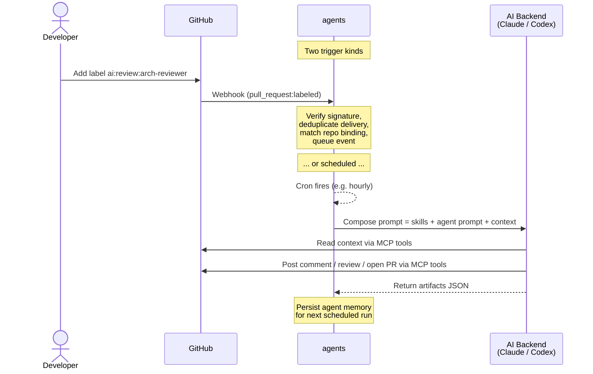

# Agents


**A self-hosted Go daemon that turns GitHub into an AI-driven development pipeline.**

Define your agents once. Wire them to repos with labels, cron schedules, or both. The daemon dispatches them via AI CLIs ([Claude Code](https://docs.anthropic.com/en/docs/claude-code), [Codex](https://github.com/openai/codex)) and lets them work through native GitHub primitives — issues, PRs, reviews, comments.

---

## Why?

- **Self-hosted, no SaaS** — your code and prompts stay on your infrastructure.
- **Multi-backend** — Claude, Codex, or any CLI that speaks MCP. Pick different backends for different agents.
- **One agent model, many triggers** — label events, cron schedules, on-demand API calls. Same agent, wired however you want.
- **Composable skills** — reusable guidance blocks (architecture, security, testing, DX, …) merged into any agent.
- **Transparent** — every agent action is a GitHub comment, issue, or PR. Reviewable. Revertable.
- **Secure by default** — HMAC-verified webhooks, API-key-gated trigger endpoint, hashed prompt logs, no direct GitHub writes from the daemon.

---

## How it works



The daemon is event-driven for label-based workflows and runs a cron scheduler for autonomous agents. Both paths resolve to the same agent definitions — only the trigger differs.

---

## Configuration at a glance

The config file is split into three conceptual domains:

```yaml
daemon:    # how the service runs: log, http, queues, backends
skills:    # reusable guidance blocks, keyed by name
agents:    # named capabilities: backend + skills + prompt
repos:     # wiring: which agents run on which repo, and when
```

Full walkthrough below. The shortest useful config is ~30 lines.

---

## Label architecture

Labels are plain strings matched against each binding's `labels` list. There is **no magic format** — you choose the labels. Convention across the example config is `ai:review:<agent-name>`, but any string works.

```yaml
repos:
  - name: "eloylp/myrepo"
    enabled: true
    use:
      # Label-triggered reviewer
      - agent: arch-reviewer
        labels: ["ai:review:arch-reviewer"]

      # Multiple agents firing on the same label (fan-out)
      - agent: arch-reviewer
        labels: ["ai:review:all"]
      - agent: sec-reviewer
        labels: ["ai:review:all"]

      # Cron-scheduled agent on the same repo
      - agent: coder
        cron: "0,30 8-18 * * *"

      # Event-triggered agent (react to any new comment)
      - agent: coder
        events: ["issue_comment.created"]
```

Rules:

- Labels are case-insensitive and trimmed. Only `labeled` actions fire (not `unlabeled`).
- The trigger label comes from the webhook event payload, not the issue/PR's current label set.
- Draft PRs skip `pull_request.labeled` for both `labels:` and `events:` bindings; they may still receive other event kinds such as `pull_request.opened` and `pull_request.synchronize`.
- `events:` bindings fire on the exact event kinds listed, with no additional filtering.
- Multiple bindings matching the same event fan out in parallel (capped by `daemon.processor.max_concurrent_agents`).

---

## Requirements

| Dependency | Purpose |
|---|---|
| **Go 1.22+** | Build the daemon |
| **GitHub CLI** (`gh`) | Authenticated access used by the AI CLIs' GitHub MCP tools |
| **AI CLI** (Claude Code and/or Codex) | The actual AI backend, with GitHub MCP server configured |

> **Why `gh` when the daemon never calls it?** The daemon only spawns the AI CLI and passes a prompt. The CLI uses GitHub MCP tools to read and write; those tools rely on `gh` authentication under the hood.

### Setup

```bash
# GitHub CLI
brew install gh
gh auth login
```

Then follow the official setup guides:
- [Claude Code](https://code.claude.com/docs/en/setup) + [GitHub MCP](https://github.com/github/github-mcp-server/blob/main/docs/installation-guides/install-claude.md)
- [Codex](https://github.com/openai/codex) + [GitHub MCP](https://github.com/github/github-mcp-server/blob/main/docs/installation-guides/install-codex.md)

---

## Configuration

Copy `config.example.yaml` to `config.yaml` and adapt it.

### `daemon` — how the service runs

```yaml
daemon:
  log:
    level: info            # trace, debug, info, warn, error, fatal
    format: text           # text (human) or json (structured)

  http:
    listen_addr: ":8080"
    status_path: /status
    webhook_path: /webhooks/github
    agents_run_path: /agents/run            # POST for on-demand triggers
    webhook_secret_env: GITHUB_WEBHOOK_SECRET
    api_key_env: AGENTS_API_KEY             # Bearer token for /agents/run
    shutdown_timeout_seconds: 15

  processor:
    event_queue_buffer: 256
    max_concurrent_agents: 4                # cap on per-event fan-out

  memory_dir: /var/lib/agents/memory        # persistent autonomous agent memory

  ai_backends:
    claude:
      command: claude
      args: ["-p", "--dangerously-skip-permissions"]
      timeout_seconds: 1500
      max_prompt_chars: 12000
      redaction_salt_env: LOG_SALT

    codex:
      command: codex
      args: ["exec", "--skip-git-repo-check", "--dangerously-bypass-approvals-and-sandbox"]
      timeout_seconds: 600
      max_prompt_chars: 12000
      redaction_salt_env: LOG_SALT
```

### `skills` — reusable guidance blocks

```yaml
skills:
  architect:
    prompt: |
      Focus on architecture boundaries, coupling, extensibility, and maintainability risks.

  security:
    prompt: |
      Focus on authn/authz, secrets exposure, injection vectors, and unsafe defaults.
```

Skills are referenced by name from agents. You can also use `prompt_file: path/to/file.md` instead of inline `prompt`.

### `agents` — named capabilities

```yaml
agents:
  # Short inline prompt — reviewer that never opens PRs (default)
  - name: arch-reviewer
    backend: auto              # auto | claude | codex
    skills: [architect]
    prompt: |
      You are an architecture-focused PR reviewer. Post one high-signal review comment.

  # Prompt loaded from a file (recommended for longer prompts)
  # allow_prs: true lets this agent open pull requests
  - name: coder
    backend: claude
    skills: [architect, testing]
    prompt_file: prompts/coder.md
    allow_prs: true            # required for agents that open PRs
```

Each agent is a pure capability definition: backend + skills + prompt. Agents don't run until a repo binds them to a trigger.

- `backend: auto` picks the first configured backend in `daemon.ai_backends` (claude before codex).
- `prompt_file` paths are resolved relative to the config file's directory.
- Agent names must be unique.
- `allow_prs` (default `false`) — when `false`, the scheduler prepends a hard instruction
  forbidding the agent from opening pull requests, regardless of what the prompt says. Set
  `allow_prs: true` only on agents that are explicitly meant to author PRs (e.g. coders,
  refactorers). Reviewer-only agents should leave this unset.

### `repos` — wiring

```yaml
repos:
  - name: "owner/repo"
    enabled: true
    use:
      - agent: arch-reviewer
        labels: ["ai:review:arch-reviewer"]

      - agent: coder
        cron: "0,30 8-18 * * *"             # standard 5-field cron

      - agent: nightly-scout
        cron: "0 7 * * *"
        enabled: false                       # temporarily off without deletion
```

Each `use` entry binds one agent to one trigger. An agent can appear multiple times with different triggers. A binding must have at least one of `labels:`, `events:`, or `cron:`.

```yaml
repos:
  - name: "owner/repo"
    enabled: true
    use:
      # Label-triggered reviewer
      - agent: arch-reviewer
        labels: ["ai:review:arch-reviewer"]

      # React to every new issue comment (issues and PRs alike)
      - agent: coder
        events: ["issue_comment.created"]

      # React to new commits pushed to any branch
      - agent: sec-reviewer
        events: ["push"]

      # Multiple event kinds in one binding (fan-out fires the agent once per match)
      - agent: pr-reviewer
        events: ["pull_request.opened", "pull_request.synchronize"]
```

A binding must set exactly one of `labels:`, `events:`, or `cron:` — mixing trigger types in a single binding is rejected at startup.

#### Supported event kinds

The `events:` field accepts any of the following GitHub event kinds. Each event delivers a `## Runtime context` block into the agent's prompt with `Event`, `Actor` (the GitHub login that triggered it), an issue/PR number where applicable, and the payload fields listed below.

| Kind | When | Payload fields |
|------|------|----------------|
| `issues.labeled` | Issue receives any label | `label` |
| `issues.opened` | Issue opened | `title`, `body` |
| `issues.edited` | Issue body or title edited | `title`, `body` |
| `issues.reopened` | Issue reopened | `title`, `body` |
| `issues.closed` | Issue closed | `title`, `body` |
| `pull_request.labeled` | PR receives any label (draft PRs are skipped) | `label` |
| `pull_request.opened` | PR opened | `title`, `draft` |
| `pull_request.synchronize` | New commit pushed to PR branch | `title`, `draft` |
| `pull_request.ready_for_review` | Draft PR marked ready | `title`, `draft` |
| `pull_request.closed` | PR closed or merged | `title`, `draft`, `merged` (`true` when PR was merged, `false` when closed without merge) |
| `issue_comment.created` | Comment posted on an issue or PR | `body` |
| `pull_request_review.submitted` | Formal GitHub review submitted | `state`, `body` |
| `pull_request_review_comment.created` | Inline review comment posted on a PR diff | `body` |
| `push` | Commit pushed to a branch | `ref` (e.g. `refs/heads/main`), `head_sha` |

> **`push` scope:** only branch pushes fire the event. Tag pushes, branch deletions, and pushes to non-`refs/heads/` refs are silently dropped. The agent receives the branch ref and the resulting head SHA — there is no PR number in the context.

Additional rules:

- `issues.*` events that originate from a PR-backed GitHub issue are dropped; the corresponding `pull_request.*` event covers them instead.
- `pull_request.labeled` events on draft PRs are dropped at the webhook boundary. Use `events: ["pull_request.ready_for_review"]` to act when a draft is marked ready.
- Unknown event kinds are rejected at config load time with a clear error listing the supported set.

### Environment variables

Create a `.env` file in the project root (loaded automatically):

```bash
GITHUB_WEBHOOK_SECRET=your-webhook-secret
AGENTS_API_KEY=optional-bearer-token-for-on-demand-triggers
LOG_SALT=optional-prompt-hash-salt
```

---

## Running

```bash
# Directly
go run ./cmd/agents -config config.yaml

# Or build first
go build -o agents ./cmd/agents
./agents -config config.yaml
```

### On-demand agent pass

Run one autonomous agent synchronously and exit (useful for testing):

```bash
./agents -config config.yaml --run-agent coder --repo owner/repo
```

Or via HTTP on the running daemon:

```bash
curl -X POST https://<your-host>/agents/run \
  -H "Authorization: Bearer $AGENTS_API_KEY" \
  -H "Content-Type: application/json" \
  -d '{"agent":"coder","repo":"owner/repo"}'
```

The agent must be bound to the target repo (any trigger kind works).

### Docker

```bash
docker compose up -d
docker compose up -d --build   # rebuild after code changes
docker compose logs -f agents
docker compose down
```

The compose file expects:
- `config.yaml` in the project root (mounted read-only at `/etc/agents/config.yaml`)
- `prompts/` directory with any `prompt_file` targets (mounted read-only at `/etc/agents/prompts`)
- `.env` in the project root with `GITHUB_WEBHOOK_SECRET` (and optionally `AGENTS_API_KEY`, `LOG_SALT`)

#### Volume mounts

| Host path | Container path | Purpose |
|---|---|---|
| `config.yaml` | `/etc/agents/config.yaml` (read-only) | Main daemon config |
| `prompts/` | `/etc/agents/prompts` (read-only) | Prompt files referenced by `prompt_file:` |
| `~/.claude` | `/home/agents/.claude` | Claude Code session data |
| `~/.claude.json` | `/home/agents/.claude.json` | Claude Code main config |
| `~/.codex` | `/home/agents/.codex` | Codex configuration |
| `~/.config/gh` | `/home/agents/.config/gh` (read-only) | GitHub CLI auth tokens |
| `agents-memory` (volume) | `/var/lib/agents/memory` | Autonomous agent memory across restarts |

#### MCP server configuration

Claude Code stores MCP config per-project, keyed by working directory in `~/.claude.json`. Since the container's working directory is `/`, ensure `~/.claude.json` has a project entry for `/` with the GitHub MCP server configured. Verify with:

```bash
docker exec agents claude mcp list
```

---

## GitHub webhook setup

1. Go to **Settings → Webhooks → Add webhook** in your repository.
2. **Payload URL**: `https://<your-host>/webhooks/github`
3. **Content type**: `application/json`
4. **Secret**: same value as `GITHUB_WEBHOOK_SECRET`.
5. **Events**: pick **Issues** and **Pull requests**.
6. **Active**: checked.

GitHub sends a ping immediately; the daemon will log the delivery.

---

## HTTP endpoints

| Method | Path | Auth | Description |
|---|---|---|---|
| `GET` | `/status` | none | Health check: JSON with uptime, queue depths, agent schedules |
| `POST` | `/webhooks/github` | `X-Hub-Signature-256` HMAC | GitHub webhook receiver |
| `POST` | `/agents/run` | `Authorization: Bearer <key>` | On-demand agent trigger |
| `POST` | `/v1/messages` | none | Anthropic↔OpenAI translation proxy (opt-in via `proxy.enabled`) |

The `/agents/run` body is `{"agent": "<name>", "repo": "owner/repo"}`. It blocks until the agent finishes. If `api_key_env` is not configured the endpoint returns `403 Forbidden`.

Duplicate webhook deliveries are suppressed via `X-GitHub-Delivery` with a TTL cache.

---

## Local / OpenAI-compatible backends

The daemon includes a built-in Anthropic Messages ↔ OpenAI Chat Completions translation proxy. Enable it to run the `claude` CLI against any OpenAI-compatible backend (Ollama, llama.cpp, vLLM, Qwen, etc.) without a separate sidecar.

```yaml
daemon:
  proxy:
    enabled: true
    path: /v1/messages          # default; configurable
    upstream:
      url: http://localhost:8001/v1   # OpenAI-compat base URL
      model: qwen3                    # model name sent upstream
      api_key_env: LOCAL_LLM_API_KEY  # optional; omit if not required
      timeout_seconds: 120
      extra_body:                     # forwarded verbatim on every request
        chat_template_kwargs:
          enable_thinking: false
```

Then point the Claude CLI at the daemon:

```bash
ANTHROPIC_BASE_URL=http://localhost:8080 claude -p "Summarise the repo."
```

The proxy translates text turns, tool use / tool results, system messages, stop reasons, and usage counters. Streaming, vision, and prompt-caching control blocks are not supported in v1.

---

## AI runner contract

The daemon spawns the configured CLI, sends the composed prompt on **stdin**, and expects a **single JSON object on stdout**:

```json
{
  "summary": "Reviewed PR for security vulnerabilities",
  "artifacts": [
    {
      "type": "pr_review",
      "part_key": "review/claude/security",
      "github_id": "123456",
      "url": "https://github.com/owner/repo/pull/1#pullrequestreview-123456"
    }
  ]
}
```

The metadata is used for observability, logging, and run summaries. Agents that don't post anything still return an empty `artifacts: []`.

---

## Security

- **Webhook verification** — HMAC SHA-256 on every payload (`X-Hub-Signature-256`).
- **API key gating** — `/agents/run` requires a Bearer token from `api_key_env`.
- **Read-only daemon** — all GitHub writes go through the AI backend's MCP tools.
- **Prompt redaction** — prompts are never logged in plaintext; only their hash and length.
- **`--dangerously-skip-permissions`** — required for headless Claude operation. Ensure the host is trusted.

---

## Logging

Two formats via `daemon.log.format`:

- **`text`** (default) — coloured, human-readable.
- **`json`** — structured for log aggregation (Loki, Datadog, etc).

Every entry includes `repo`, `issue_number` or `pr_number`, and `component` for filtering.

```json
{"level":"info","component":"workflow_engine","repo":"owner/repo","pr_number":42,"backend":"claude","message":"invoking ai agent"}
```

---

## Testing

```bash
go test ./... -race
```

---

## Project structure

```
cmd/agents/main.go          # Daemon entry point + --run-agent mode
internal/
  config/                   # YAML parsing, prompt file resolution, validation
  ai/                       # Prompt composition + CLI runner
  autonomous/               # Cron scheduler + filesystem-backed agent memory
  workflow/                 # Event routing engine, queues, processor
  webhook/                  # HTTP server, signature verification, delivery dedupe
  setup/                    # Interactive first-time setup command
  logging/                  # zerolog setup
prompts/                    # Optional: prompt files referenced by prompt_file
```
