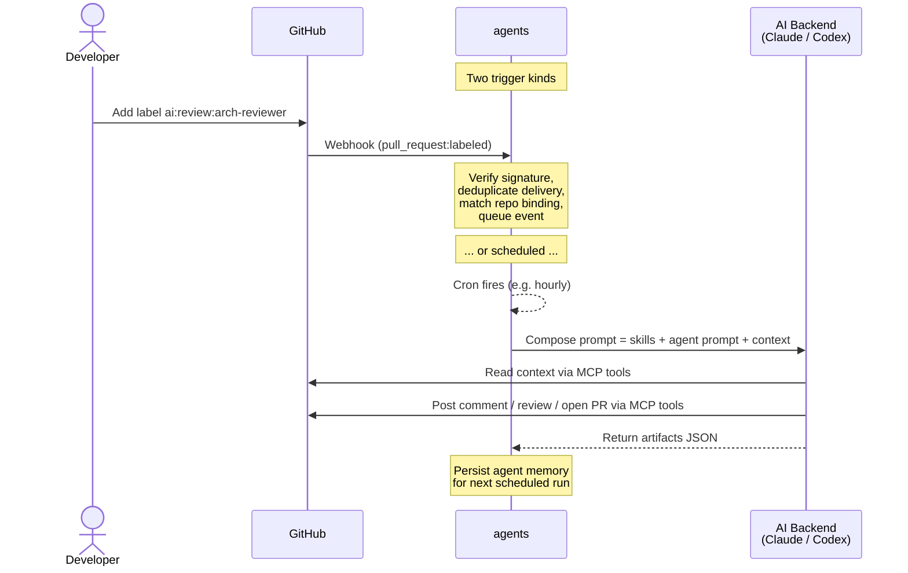

# Agents


**Your personal, provider-agnostic tool for building reusable, event-driven agentic workflows.**

Define your agents once. Wire them to repos with labels, cron schedules, or event subscriptions. The daemon dispatches them via AI CLIs ([Claude Code](https://docs.anthropic.com/en/docs/claude-code), [Codex](https://github.com/openai/codex)) and lets them work through native GitHub primitives -- issues, PRs, reviews, comments.

---

## Features

- **Self-hosted, no SaaS** -- your code and prompts stay on your infrastructure.
- **Multi-backend** -- Claude, Codex, or any CLI that speaks MCP. Mix backends per agent.
- **Local model support** -- built-in Anthropic-to-OpenAI translation proxy routes the fleet through `llama.cpp`, Ollama, vLLM, or any OpenAI-compatible endpoint. Zero vendor lock-in.
- **One agent model, many triggers** -- label events, cron schedules, GitHub event subscriptions, on-demand API calls. Same agent, wired however you want.
- **Composable skills** -- reusable guidance blocks (architecture, security, testing, DX, ...) merged into any agent.
- **Reactive inter-agent dispatch** -- agents invoke each other at runtime with depth, fanout, and dedup safety limits.
- **SQLite config store** -- manage the fleet over a CRUD API instead of editing YAML. Import/export between the two.
- **Built-in web dashboard** -- live event firehose, agent traces with tool-loop transcripts, dispatch graph, memory viewer.
- **Transparent** -- every agent action is a GitHub comment, issue, or PR. Reviewable. Revertable.
- **Secure by default** -- HMAC-verified webhooks, hashed prompt logs, read-only daemon (all GitHub writes go through the AI backend's MCP tools).

---

## Web dashboard

The daemon ships an embedded web dashboard at `/ui/` with real-time views of your fleet:

<!-- TODO: add screenshots of the dashboard pages (events, traces, graph, agents, memory) -->

| Page | What it shows |
|------|---------------|
| **Events** | Live webhook event firehose with SSE streaming |
| **Traces** | Agent run traces with timing, status, and drill-down to tool-loop transcripts |
| **Graph** | Visual dispatch graph -- which agents invoke which, with edge counts |
| **Agents** | Fleet snapshot -- per-agent status, skills, bindings, dispatch wiring |
| **Memory** | Raw agent memory markdown per (agent, repo) pair |
| **Config** | Effective parsed config (secrets redacted) |

---

## How it works



The daemon is event-driven for label-based workflows and runs a cron scheduler for autonomous agents. Both paths resolve to the same agent definitions -- only the trigger differs.

---

## Quick start

### Requirements

| Dependency | Purpose |
|---|---|
| **Go 1.25+** | Build the daemon |
| **GitHub CLI** (`gh`) | Authenticated access used by the AI CLIs' GitHub MCP tools |
| **AI CLI** (Claude Code and/or Codex) | The actual AI backend, with GitHub MCP server configured |

### Setup

```bash
# GitHub CLI
brew install gh
gh auth login
```

Then follow the official setup guides:
- [Claude Code](https://code.claude.com/docs/en/setup) + [GitHub MCP](https://github.com/github/github-mcp-server/blob/main/docs/installation-guides/install-claude.md)
- [Codex](https://github.com/openai/codex) + [GitHub MCP](https://github.com/github/github-mcp-server/blob/main/docs/installation-guides/install-codex.md)

### Build and run

```bash
# Copy and edit the example config
cp config.example.yaml config.yaml

# Run directly
go run ./cmd/agents -config config.yaml

# Or build first
go build -o agents ./cmd/agents
./agents -config config.yaml
```

### On-demand agent pass

Run one autonomous agent synchronously and exit (useful for testing):

```bash
./agents -config config.yaml --run-agent coder --repo owner/repo
```

Or via HTTP on the running daemon:

```bash
curl -X POST https://<your-host>/run \
  -H "Content-Type: application/json" \
  -d '{"agent":"coder","repo":"owner/repo"}'
```

### GitHub webhook setup

1. Go to **Settings -> Webhooks -> Add webhook** in your repository.
2. **Payload URL**: `https://<your-host>/webhooks/github`
3. **Content type**: `application/json`
4. **Secret**: same value as `GITHUB_WEBHOOK_SECRET`.
5. **Events**: enable **Issues**, **Pull requests**, **Issue comments**, **Pull request reviews**, **Pull request review comments**, and/or **Pushes** -- whichever ones you want to trigger agents on. Unused events are silently dropped.
6. **Active**: checked.

---

## Documentation

| Document | What it covers |
|----------|----------------|
| [Configuration](docs/configuration.md) | Full config walkthrough: daemon, skills, agents, repos, labels, environment variables, SQLite mode |
| [Supported events](docs/events.md) | All GitHub event kinds, payload fields, and filtering rules |
| [Inter-agent dispatch](docs/dispatch.md) | Reactive dispatch: response contract, safety limits, config wiring |
| [HTTP API](docs/api.md) | All endpoints: core, observability, proxy, CRUD, and the AI runner contract |
| [Docker deployment](docs/docker.md) | Docker Compose setup, volume mounts, MCP configuration |
| [Local models](docs/local-models.md) | Run the fleet on your own LLM: proxy setup, model picks, tuning, cost math |
| [Security](docs/security.md) | Webhook verification, prompt redaction, access control model |
| [Contributing](CONTRIBUTING.md) | How to contribute: issues-first model, what makes a great issue |

---

## Project structure

```
cmd/agents/main.go          # Daemon entry point + --run-agent / --db / --import modes
internal/
  config/                   # YAML parsing, prompt/skill file resolution, validation
  ai/                       # Prompt composition + command-based CLI runner (per-backend env)
  anthropic_proxy/          # Built-in Anthropic-to-OpenAI translation proxy (opt-in)
  observe/                  # Observability store (events, traces, dispatch graph, SSE hubs)
  autonomous/               # Cron scheduler + agent memory (SQLite-backed)
  store/                    # SQLite-backed config store (--db mode): schema migrations, CRUD helpers
  workflow/                 # Event routing engine, single event queue, processor, inter-agent dispatcher
  webhook/                  # HTTP server, signature verification, delivery dedupe, CRUD API handlers
  ui/                       # Embedded Next.js web dashboard (served at /ui/)
  setup/                    # Interactive first-time setup command
  logging/                  # zerolog setup
prompts/                    # Optional: prompt files referenced by agent prompt_file
skills/                     # Optional: skill files referenced by skill prompt_file
docs/                       # Long-form docs (configuration, events, dispatch, API, docker, etc.)
```

---

## Testing

```bash
go test ./... -race
```

---

## Logging

Two formats via `daemon.log.format`:

- **`text`** (default) -- coloured, human-readable.
- **`json`** -- structured for log aggregation (Loki, Datadog, etc).

Every entry includes `repo`, `issue_number` or `pr_number`, and `component` for filtering.

```json
{"level":"info","component":"workflow_engine","repo":"owner/repo","pr_number":42,"backend":"claude","message":"invoking ai agent"}
```

---

## Contributing

This project is built by its own agent fleet. **You bring the ideas, the agents bring the implementation.** Open an issue with the `discussing` label, a maintainer triages it, and the autonomous coder agent implements accepted issues -- reviewed by the pr-reviewer agent before merge.

See **[CONTRIBUTING.md](CONTRIBUTING.md)** for the full process, what makes a great issue, and the exceptions (doc typo PRs and security patches are accepted directly).
