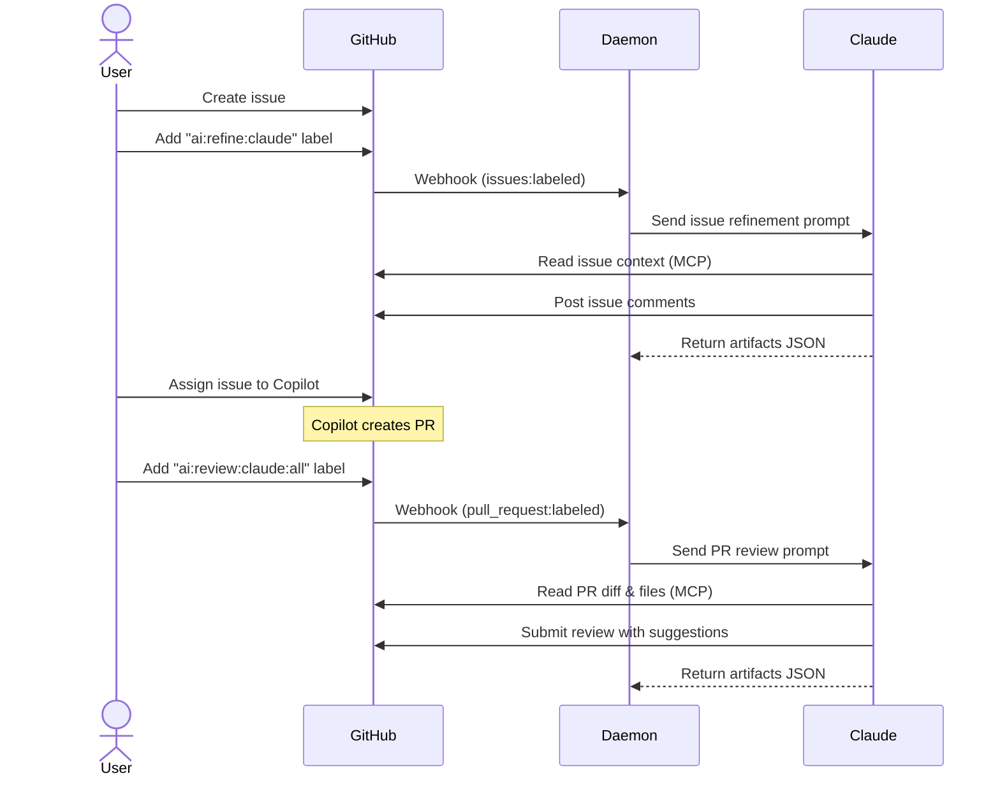

# agents

A Go daemon that receives GitHub webhooks for issues and pull requests, then launches AI CLI agents ([Claude Code](https://docs.anthropic.com/en/docs/claude-code), Codex, etc.) selected dynamically from labels to provide automated feedback via the GitHub MCP server.

## Available workflows

### Issue refinement (`ai:refine` labels)

Labels:
- `ai:refine`
- `ai:refine:<agent>`

Supported backends: `claude`, `codex`.

Each issue refinement run uses exactly one backend and posts exactly one structured issue comment.

### PR specialist review (`ai:review` labels)

Labels:
- `ai:review`
- `ai:review:<agent>:<role>`
- `ai:review:<agent>:all`

Roles: `architect`, `security`, `testing`, `devops`, `ux`.

`all` expands to all specialist agents configured for that backend and runs them concurrently. Each role label still counts as one run against quota limits.

## Flow



The daemon reacts only to `issues` / `pull_request` webhook events with `action` `labeled` or `unlabeled`. All detailed reads and writes (issue comments, PR reviews) are delegated to the configured AI backend via MCP tools.

## Requirements

- **Go** 1.22+
- **GitHub CLI** (`gh`) authenticated with access to monitored repositories
- **AI CLI backend**: Claude Code CLI or Codex CLI, with the GitHub MCP server configured

### Setting up the GitHub CLI

Install and authenticate:

```bash
# Install (macOS)
brew install gh

# Authenticate
gh auth login
```

### Setting up Claude Code CLI with the GitHub MCP server

Install Claude Code and add the GitHub MCP server:

```bash
# Install Claude Code
npm install -g @anthropic-ai/claude-code

# Add the GitHub MCP server (uses the gh CLI under the hood)
claude mcp add github -- gh copilot mcp
```

Verify the server is registered:

```bash
claude mcp list
```

### Setting up Codex CLI with the GitHub MCP server

Follow the official Codex + GitHub MCP setup guide:

https://github.com/github/github-mcp-server/blob/main/docs/installation-guides/install-codex.md

## Configuration

Copy `config.example.yaml` to `config.yaml` and adjust:

```yaml
log:
  level: info

http:
  listen_addr: ":8080"
  status_path: /status
  webhook_path: /webhooks/github
  read_timeout_seconds: 15
  write_timeout_seconds: 15
  idle_timeout_seconds: 60
  max_body_bytes: 1048576
  webhook_secret_env: GITHUB_WEBHOOK_SECRET
  delivery_ttl_seconds: 3600

workflow:
  comment_fingerprint_limit: 5
  file_fingerprint_limit: 50
  max_fingerprint_bytes: 20000
  max_posts_per_run: 10

ai_backends:
  claude:
    mode: command
    command: claude
    args:
      - "-p"                              # print mode (non-interactive)
      - "--dangerously-skip-permissions"  # required for headless operation
    timeout_seconds: 600
    max_prompt_chars: 12000
    redaction_salt_env: LOG_SALT
    agents: [architect, security, testing, devops, ux] # allowed values for <role>; :all expands to all listed specialist agents
  codex:
    mode: command
    command: codex
    args:
      - "-p"
    timeout_seconds: 600
    max_prompt_chars: 12000
    redaction_salt_env: LOG_SALT
    agents: [architect, security, testing, devops, ux] # allowed values for <role>; :all expands to all listed specialist agents

repos:
  - full_name: "owner/repo"
    enabled: true
```

You can also create a `.env` file in the project root. The daemon loads it automatically on startup:

```
GITHUB_WEBHOOK_SECRET=...
LOG_SALT=optional-salt
```

## Running

```bash
go run ./cmd/agentd -config config.yaml
```

Or build and run:

```bash
go build -o agentd ./cmd/agentd
./agentd -config config.yaml
```

## AI runner contract

When `ai_backends.<name>.mode=command`, the daemon executes the configured command and sends the prompt via STDIN. After performing actions through MCP tools, the command must output a single JSON object to STDOUT:

```json
{
  "summary": "one-line summary of what was done",
  "artifacts": [
    {
      "type": "issue_comment",
      "part_key": "issue/part1",
      "github_id": "123456",
      "url": "https://github.com/..."
    }
  ]
}
```

The daemon persists these artifacts for idempotency (same fingerprint = no duplicate run).

## Webhook endpoints

- `GET /status` -- health endpoint
- `POST /webhooks/github` -- GitHub webhook receiver with `X-Hub-Signature-256` verification

Duplicate deliveries are ignored using `X-GitHub-Delivery` and a short-lived in-memory TTL cache.

## Logging

Structured JSON logs with correlation fields: `repo`, `issue_number`/`pr_number`, `fingerprint`, and `component`. Prompts are never logged directly; only their hash and length are recorded.

## Security

- The Go daemon verifies all webhook payloads with `X-Hub-Signature-256`.
- The Go daemon has **read-only** GitHub access for context reads. All writes go through the configured AI backend via MCP.
- MCP toolsets should be allow-listed to `repos`, `issues`, and `pull_requests`.
- `--dangerously-skip-permissions` is required for headless operation. Ensure the host environment is trusted.
- Prompts are hashed in logs; secrets are never logged.
