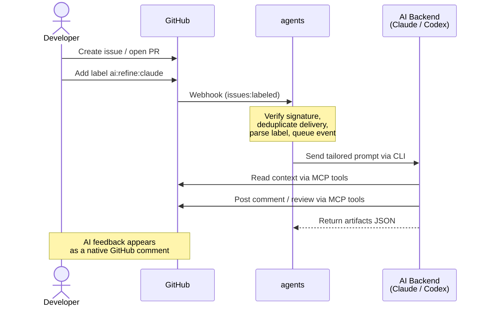

# agents

**Turn GitHub labels into AI-powered code reviews and issue refinements — automatically.**

A lightweight Go daemon that listens for GitHub webhook events and dispatches AI CLI agents ([Claude Code](https://docs.anthropic.com/en/docs/claude-code), [Codex](https://github.com/openai/codex), ...) to analyze issues and review pull requests. Just add a label, and the right AI agent shows up in seconds.

---

## Why?

- **Zero-friction** — your team already uses labels. No new tools to learn.
- **Multi-backend** — plug in Claude, Codex, or any CLI that speaks MCP.
- **Specialist reviewers** — security, architecture, testing, devops, UX — each with a focused lens.
- **Concurrent** — fan out multiple specialist reviews in parallel on a single PR.
- **Secure by design** — HMAC-verified webhooks, hashed prompt logs, read-only daemon.

---

## How it works



The daemon is **event-driven only** — no polling. It accepts the webhook, queues it internally, and dispatches work to the configured AI backend asynchronously.

---

## Label architecture

Labels are the control plane. Their format tells `agents` **what** to do, **which backend** to use, and **which agent** to activate.

### Issue refinement — `ai:refine`

| Label | Behavior |
|---|---|
| `ai:refine` | Refine with the **default** backend (first configured) |
| `ai:refine:<backend>` | Refine with a **specific** backend (e.g. `ai:refine:codex`) |

Produces **one structured comment** on the issue covering feasibility, complexity, recommended approach, acceptance criteria, and open questions.

### PR specialist review — `ai:review`

| Label | Behavior |
|---|---|
| `ai:review` | Review with the default backend, **all** specialist agents |
| `ai:review:<backend>` | Review with a specific backend, **all** agents concurrently |
| `ai:review:<backend>:<agent>` | Review with a specific backend and **single** agent |
| `ai:review:<backend>:all` | Review with a specific backend, **all** agents concurrently (explicit) |

Available agents:

| Agent | Focus area |
|---|---|
| `architect` | Architecture, boundaries, coupling, maintainability |
| `security` | Vulnerabilities, trust boundaries, secrets, unsafe defaults |
| `testing` | Coverage gaps, fragile tests, missing validation |
| `devops` | CI/CD, deployment safety, observability, operability |
| `ux` | Developer/user experience, clarity, ergonomics, error messages |

When using `:all`, every configured agent runs **concurrently** — one review comment per specialist.

### Label parsing rules

```
ai:<workflow>
ai:<workflow>:<backend>
ai:<workflow>:<backend>:<agent>
```

- Labels are **case-insensitive** and trimmed.
- Only the `labeled` action triggers processing (not `unlabeled`).
- Only labels prefixed with `ai:` are considered; all others are silently ignored.
- The trigger label comes from the **webhook event payload** (`payload.label.name`), not the issue's current label list.

### Applying review fixes — branch ownership

When an AI backend creates a PR (e.g. Codex opens a branch from an issue), **that same backend must apply any subsequent fixes** to the branch. This is because the backend that created the branch owns the local working context — a different backend cannot safely commit to it.

After a specialist review surfaces actionable feedback, **@mention the original backend** in the review comments you want addressed:

- If **Codex** opened the PR → mention `@codex` in the review comment.
- If **Claude** opened the PR → mention `@claude` in the review comment.

This ensures the correct backend picks up the fix request and commits the amendments to its own branch.

> **Example flow:**
> 1. Codex opens a PR with the implementation.
> 2. Label the PR with `ai:review:claude` → Claude reviews the PR.
> 3. Claude leaves review comments with suggested fixes.
> 4. Reply to the relevant review comments mentioning `@codex` → Codex applies the fixes to its branch.

---

## Requirements

| Dependency | Purpose |
|---|---|
| **Go 1.22+** | Build the daemon |
| **GitHub CLI** (`gh`) | Authenticated access to your repos |
| **AI CLI** (Claude Code or Codex) | The actual AI backend, with GitHub MCP server configured |

### Setup GitHub CLI

```bash
# Install (macOS)
brew install gh

# Authenticate
gh auth login
```

### Setup Claude Code + GitHub MCP

Follow the official guides:
- [Claude Code setup](https://code.claude.com/docs/en/setup)
- [GitHub MCP server for Claude](https://github.com/github/github-mcp-server/blob/main/docs/installation-guides/install-claude.md)

### Setup Codex + GitHub MCP

Follow the official guide:
[GitHub MCP server for Codex](https://github.com/github/github-mcp-server/blob/main/docs/installation-guides/install-codex.md)

---

## Configuration

Copy `config.example.yaml` to `config.yaml` and adapt it to your environment:

```yaml
log:
  level: info           # debug | info | warn | error

http:
  listen_addr: ":8080"
  webhook_path: /webhooks/github
  status_path: /status
  webhook_secret_env: GITHUB_WEBHOOK_SECRET   # env var name (not the secret itself)
  issue_queue_buffer: 256
  pr_queue_buffer: 256

ai_backends:
  claude:
    mode: command
    command: claude
    args: ["-p", "--dangerously-skip-permissions"]
    timeout_seconds: 600
    max_prompt_chars: 12000
    redaction_salt_env: LOG_SALT
    agents: [architect, security, testing, devops, ux]

  codex:
    mode: command
    command: codex
    args: ["-p"]
    timeout_seconds: 600
    max_prompt_chars: 12000
    redaction_salt_env: LOG_SALT
    agents: [architect, security, testing, devops, ux]

repos:
  - full_name: "owner/repo"
    enabled: true
```

Create a `.env` file in the project root for secrets (loaded automatically):

```
GITHUB_WEBHOOK_SECRET=your-webhook-secret
LOG_SALT=optional-redaction-salt
```

---

## Running

```bash
# Run directly
go run ./cmd/agents -config config.yaml

# Or build first
go build -o agents ./cmd/agents
./agents -config config.yaml
```

### Docker

The project includes a multi-stage Dockerfile that produces a minimal image based on `node:22-alpine`, containing the static Go binary, the AI CLIs (Claude Code, Codex), GitHub CLI, and CA certificates. The container runs as a non-root `agents` user (required by Claude Code's `--dangerously-skip-permissions` flag, which refuses to run as root).

```bash
# Build and start
docker compose up -d

# Rebuild after code changes
docker compose up -d --build

# View logs
docker compose logs -f agents

# Stop
docker compose down
```

The compose file expects:
- `config.yaml` in the project root (mounted read-only at `/etc/agents/config.yaml`)
- `.env` in the project root with `GITHUB_WEBHOOK_SECRET` (and optionally `LOG_SALT`)

#### Volume mounts

The container needs access to host CLI configurations to authenticate with AI backends and GitHub:

| Host path | Container path | Purpose |
|---|---|---|
| `~/.claude` | `/home/agents/.claude` | Claude Code session data, project settings |
| `~/.claude.json` | `/home/agents/.claude.json` | Claude Code main config (auth, MCP servers) |
| `~/.codex` | `/home/agents/.codex` | Codex configuration |
| `~/.config/gh` | `/home/agents/.config/gh` (read-only) | GitHub CLI auth tokens |

#### Environment variables

| Variable | Purpose |
|---|---|
| `HOME=/home/agents` | Ensures CLIs find their config under the non-root user's home |
| `GITHUB_WEBHOOK_SECRET` | Webhook signature verification (loaded from `.env`) |
| `GITHUB_PAT_TOKEN` | GitHub personal access token for Codex backend |

#### MCP server configuration

Claude Code stores MCP server configuration **per-project**, keyed by working directory path in `~/.claude.json`. Since the container's working directory is `/`, you must ensure `~/.claude.json` has a project entry for `/` with the MCP servers configured. For example:

```json
{
  "projects": {
    "/": {
      "mcpServers": {
        "github": {
          "type": "http",
          "url": "https://api.githubcopilot.com/mcp",
          "headers": {
            "Authorization": "Bearer <your-github-token>"
          }
        }
      }
    }
  }
}
```

Without this entry, Claude Code inside the container will not find any MCP servers. You can verify with:

```bash
docker exec agents claude mcp list
```

---

## Webhook endpoints

| Method | Path | Description |
|---|---|---|
| `GET` | `/status` | Health check — returns `ok` |
| `POST` | `/webhooks/github` | Webhook receiver with `X-Hub-Signature-256` verification |

Duplicate deliveries are automatically suppressed using `X-GitHub-Delivery` with an in-memory TTL cache.

---

## AI runner contract

When `mode: command`, the daemon executes the CLI and sends the prompt via **stdin**. The CLI performs its work through MCP tools and must print a **single JSON object to stdout**:

```json
{
  "summary": "Reviewed PR for security vulnerabilities",
  "artifacts": [
    {
      "type": "pr_review",
      "part_key": "review/claude/security",
      "github_id": "123456",
      "url": "https://github.com/owner/repo/pull/1#pullrequestreview-123456"
    }
  ]
}
```

The daemon uses this metadata for observability, logging, and run summaries.

---

## Security

- **Webhook verification** — all payloads are validated with HMAC SHA-256 (`X-Hub-Signature-256`).
- **Read-only daemon** — `agents` itself never writes to GitHub. All writes go through the AI backend via MCP tools.
- **Prompt redaction** — prompts are never logged in plaintext; only their hash and length are recorded.
- **MCP scoping** — toolsets should be allow-listed to `repos`, `issues`, and `pull_requests`.
- **`--dangerously-skip-permissions`** — required for headless Claude Code operation. Ensure the host environment is trusted.

---

## Logging

Structured JSON logs with correlation fields:

```json
{"level":"info","component":"workflow_engine","repo":"owner/repo","issue_number":42,"backend":"claude","message":"invoking ai backend for issue refinement"}
```

Every log entry includes `repo`, `issue_number` or `pr_number`, and `component` for easy filtering and tracing.

---

## Testing

```bash
go test ./...
```

---

## Project structure

```
cmd/agents/main.go            # Daemon entry point
internal/
  config/config.go             # YAML config parsing, env var resolution
  ai/                          # Prompt generation + runner contract
  workflow/                    # Label parsing, request types, event orchestration
  webhook/                     # HTTP server, signature verification, delivery dedupe
  logging/logging.go           # Structured logger setup (zerolog)
```
