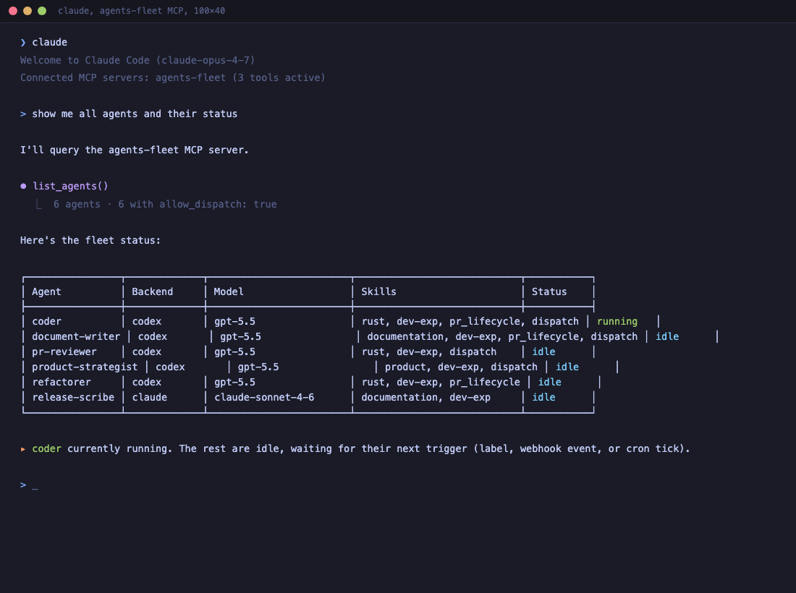

# MCP server

The daemon exposes a [Model Context Protocol](https://modelcontextprotocol.io) server at `/mcp` over the Streamable HTTP transport. MCP-capable clients (Claude Code, Cursor, Cline, ...) register the endpoint once and then discover the available tools automatically. From there you can manage agents, skills, repos, and bindings, trigger runs, and inspect traces conversationally from your editor.

The MCP surface is functionally equivalent to the REST CRUD API documented in [api.md](api.md). The difference is the wire protocol and the consumer: REST is for scripts and dashboards; MCP is for AI clients that can call tools.



## Register the server

From Claude Code:

```bash
claude mcp add -t http -s user agents-fleet https://agents.example.com/mcp \
  -H "Authorization: Basic $(echo -n 'user:password' | base64)"
```

When the daemon runs behind a reverse proxy with basic auth (e.g. Traefik), the `-H` flag passes the credentials so MCP requests authenticate automatically. For unauthenticated local development, drop the `-H` flag.

The same pattern works for Cursor, Cline, and any other MCP-compatible client; consult their docs for the exact config syntax.

## Available tools

### Fleet management

| Tool | Description |
|---|---|
| `list_agents` | List all agents with backend, model, skills, dispatch wiring. |
| `get_agent` | Fetch one agent by name. |
| `create_agent` | Create or update an agent (upsert, full replace). |
| `update_agent` | Partially update an agent by name (only supplied fields are changed). |
| `delete_agent` | Delete an agent. `cascade=true` also removes repo bindings. |
| `list_skills` | List all skills with prompt content. |
| `get_skill` | Fetch one skill by name. |
| `create_skill` | Create or update a skill (full replace). |
| `update_skill` | Partially update a skill by name. |
| `delete_skill` | Delete a skill. |
| `list_backends` | List all AI backends with models and health. |
| `get_backend` | Fetch one backend by name. |
| `create_backend` | Create or update a backend (full replace). |
| `update_backend` | Partially update a backend by name. |
| `delete_backend` | Delete a backend. |
| `list_repos` | List all repos with bindings. |
| `get_repo` | Fetch one repo by name. |
| `create_repo` | Create or update a repo with bindings (full replace of the bindings list). |
| `update_repo` | Toggle a repo's `enabled` flag without churning binding IDs. Only `enabled` is patchable; binding edits go through the binding tools below. |
| `delete_repo` | Delete a repo and its bindings. |
| `create_binding` | Create one binding on a repo; returns the persisted binding with its generated ID. |
| `get_binding` | Fetch one binding by ID, scoped to a repo. |
| `update_binding` | Replace all fields of a binding by ID. |
| `delete_binding` | Delete a binding by ID. |
| `list_guardrails` | List every prompt guardrail (built-in + operator-added) in render order. |
| `get_guardrail` | Fetch one guardrail by name. |
| `create_guardrail` | Create or update an operator-defined guardrail. Built-in flags (`is_builtin`, `default_content`) are migration-managed and ignored on the wire. |
| `update_guardrail` | Partially update a guardrail by name. Patchable: `description`, `content`, `enabled`, `position`. |
| `delete_guardrail` | Delete a guardrail. Built-ins can be deleted from the MCP path; the dashboard double-confirms in the UI. |
| `reset_guardrail` | Copy a built-in guardrail's `default_content` back into its `content`. Returns a validation error on operator-added rows. |

### Operations

| Tool | Description |
|---|---|
| `get_status` | Daemon health: uptime, queue depth, schedules, dispatch counters. |
| `trigger_agent` | Fire an on-demand agent run (async, returns event ID). |

### Observability

| Tool | Description |
|---|---|
| `list_events` | Recent events with optional `since` filter. |
| `list_traces` | Recent agent run spans with timing, summary, and token usage (`input_tokens`, `output_tokens`, `cache_read_tokens`, `cache_write_tokens`, `prompt_size`). The composed prompt body is fetched separately via the `/traces/{span_id}/prompt` REST endpoint, not an MCP tool, since it can be many KB. |
| `get_trace` | Full dispatch chain by root event ID. |
| `get_trace_steps` | Tool-loop transcript for one span. |
| `get_trace_prompt` | Composed prompt the daemon sent to the AI CLI for one span (gzipped on disk; decompressed on the fly). The "what did the agent see" debug artefact. Errors when no prompt is recorded (pre-009-migration spans). |

The live stdout stream (`GET /traces/{span_id}/stream`) is intentionally not mirrored as an MCP tool, SSE is a long-lived streaming protocol that doesn't fit MCP's request/response contract. MCP clients that need the post-completion transcript use `get_trace_steps` instead.
| `get_graph` | Agent interaction graph (dispatch edges). |
| `get_dispatches` | Dispatch counters and drop reasons. |
| `get_memory` | Agent memory for an agent/repo pair. |

### Runners

These tools mirror the `/runners` REST surface; see [api.md](api.md#runners-management) for the wire shape, JOIN-with-traces semantics, and retry behaviour.

| Tool | Description |
|---|---|
| `list_runners` | One row per (event, agent) once traces have been recorded; one row per event with `agent: null` while in-flight. Carries event metadata (kind, repo, number, actor, target_agent, payload, timestamps) plus trace fields (agent, span_id, run_duration_ms, summary, prompt_size, input_tokens, output_tokens, cache_read_tokens, cache_write_tokens) when present. Optional `status` filter on the event_queue lifecycle (`enqueued`/`running`/`completed`); `limit` (default 100); `offset`. |
| `delete_runner` | Remove an event_queue row by id. Best-effort, if a worker has already dequeued the QueuedEvent from the channel buffer it will still run. Event-level: affects every fanned-out agent for this event. |
| `retry_runner` | Re-enqueue an event by copying its blob into a fresh row and pushing onto the channel. Re-runs every fanned-out agent (event-level retry). The original row stays as audit history. Errors when the source is in `running` state, when the channel is full, or when the queue has been closed. |

### Config

| Tool | Description |
|---|---|
| `get_config` | Current fleet config snapshot. |
| `export_config` | Fleet config as YAML (round-trippable via `import_config`). |
| `import_config` | Import YAML config. `mode=replace` prunes missing entries. |
