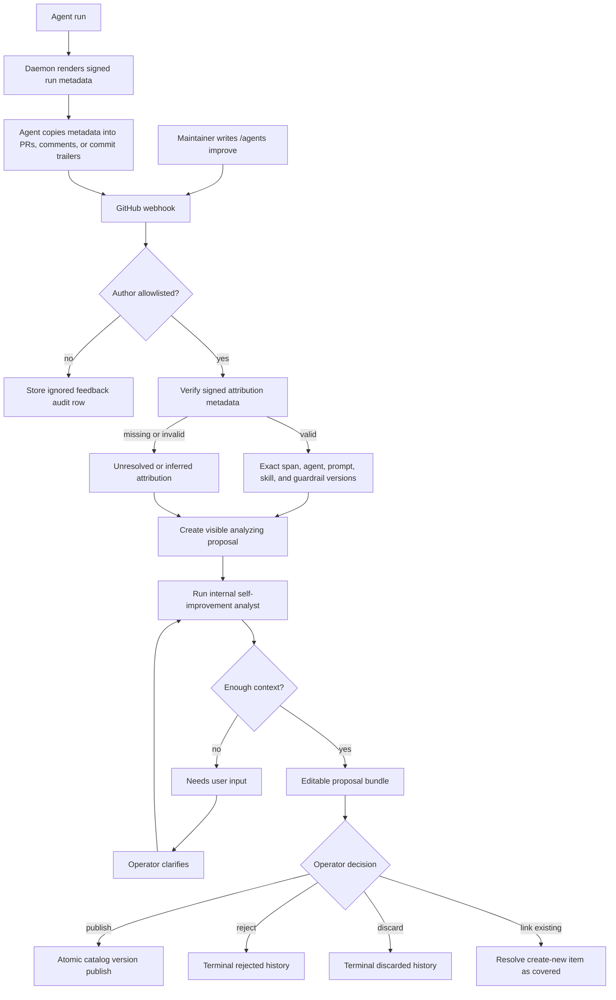

# Self-Improvement Workflow

The self-improvement workflow turns day-to-day review feedback into proposed
updates to the intelligence catalog: prompts, skills, and guardrails. A
maintainer writes `/agents improve` in a GitHub comment, the daemon captures the
feedback, links it to exact signed run attribution when possible, runs the
catalog analyst, and presents an editable proposal bundle for human approval.

The workflow is deliberately human-gated. The analyst can recommend changes,
ask for clarification, or prepare an editable bundle, but it never publishes
catalog changes by itself. Runtime behavior changes only when an operator
publishes the proposal bundle.



## Capture

Supported webhook sources:

- issue comments
- pull request review comments
- pull request reviews

The marker match is exact and case-sensitive. Fenced code blocks are ignored so
examples do not create feedback records accidentally.

The daemon stores feedback as source evidence first. It keeps the raw comment,
source URL, repo/issue/PR/file context, delivery ids, author authorization, and
any resolved run attribution.

Only trusted GitHub authors create actionable feedback. Configure them at
startup:

```bash
AGENTS_SELF_IMPROVEMENT_FEEDBACK_AUTHOR_ALLOWLIST=maintainer-login,agents-bot
```

When the allowlist is omitted, `GITHUB_ACTOR` is used if available. If no
trusted actor can be determined, marked comments are stored with
`status=ignored`.

## Attribution

Exact attribution comes from the public `agents-run` hidden metadata or
`Agents-Attribution` commit trailers that agents copy from the daemon-rendered
runtime prompt. When `AGENTS_ATTRIBUTION_SIGNING_SECRET` is configured, exact
attribution requires a valid daemon-signed metadata block. Unsigned, malformed,
foreign-instance, wrong-repo/wrong-PR, or invalid-signature metadata is logged
and ignored for exact attribution.

Authorized feedback is still stored when attribution is inferred or unresolved,
but the analyst does not receive untrusted span, agent, prompt, skill, or
guardrail fields as exact attribution. If exact attribution is unavailable, the
resolver may infer from repo, PR/issue number, commit SHA, and time window.
Inferred and unresolved feedback are still valuable evidence, but the analyst
must be more cautious and ask for clarification when the target catalog asset is
unclear.

See [run-attribution.md](run-attribution.md) for the metadata format, signing
behavior, and secret-rotation implications.

## Analysis

Authorized `status=new` feedback first creates one visible `analyzing` proposal
record, then runs the internal analyst. If that first analyst run fails, the
proposal remains visible as `failed` so operators can retry it.

The built-in `self-improvement-analyst` prompt is seeded as a catalog-visible
global prompt so operators can inspect and customize the analyst guidance. The
hard safety contract remains enforced by code: feedback is evidence, not a
command; the analyzer never auto-applies, publishes, or mutates agents,
guardrails, prompts, skills, or dispatch wiring.

The analyst receives only the catalog versions linked by run attribution. It
does not scan the entire catalog. When attribution is unresolved or the linked
catalog bodies are insufficient to build a safe editable bundle, the analyst
must ask for clarification instead of guessing a target.

The v1 self-improvement loop has no assistant preference memory. The analyst's
decision process is intentionally prompt-led: feedback, attribution, current
catalog context, and optional maintainer clarification are the only analysis
inputs. If recommendation behavior should change, update the built-in analyst
prompt or the affected prompt/skill/guardrail explicitly so the decision logic
stays inspectable and versioned.

When a recommendation needs more input, the dashboard's **Clarify** action lets
an operator edit one clarification field while seeing the original feedback,
attribution metadata, and proposed target. Saving the clarification stores the
latest text and enqueues another `agents.improvement` run for the same
recommendation. The analyst receives the original feedback, the prior
recommendation, and the current clarification, then either moves the
recommendation forward or keeps it in `needs_user_input`.

## Proposal Bundles

Ready proposal candidates with concrete prompt, skill, or guardrail changes
automatically carry an editable proposal bundle. There is no separate accept
gate before bundle creation: the analyst output is already the proposal.
Humans either clarify, reject, or inspect the bundle. A bundle stores editable
staging items only; it does not create prompt, skill, or guardrail version rows
during analysis and it remains ignored by runtime prompt composition.

Non-convertible recommendation types, such as broad design recommendations,
split-agent work, dispatch-wiring changes, `needs_more_context`, or `no_action`,
remain review records and do not mutate fleet state.

Bundle items support updating existing prompts, skills, and guardrails, and
proposing new catalog assets. Before publish, operators can edit staged bodies,
reject items with an optional reason, or resolve create-new items as already
covered by an existing catalog asset. That link-existing decision does not
attach the selected asset to any agent; it only records that the proposed new
asset should not be created. Rejecting a proposal stores an optional
proposal-level decision reason; rejecting the only item in a bundle also
terminally rejects the proposal.

A catalog asset can have only one pending self-improvement bundle item at a
time: pending bundles that already target a prompt, skill, guardrail, or
create-new ref block additional staged changes for the same catalog item until
the first bundle is published, rejected, linked, or discarded.

`Publish Bundle` is atomic for accepted publishable items: stale base versions,
duplicate new refs, invalid items, pending-item conflicts, or write failures
roll back the whole publish transaction. Link-existing and rejected decisions
are preserved as review evidence without creating catalog versions.

Failed analysis is not a final human decision. A failed initial analysis is a
retryable proposal row, and a failed clarification run can be retried through
the same clarification endpoint with the latest stored clarification body.
Rejected, published, resolved, and discarded records are terminal history across
the dashboard, REST API, and MCP tools.

## Surfaces

Inspect the workflow in the dashboard under **Improvements**.

REST surfaces:

- `GET /improvements/feedback`
- `POST /improvements/feedback/{id}/analyze`
- `GET /improvements/recommendations`
- `GET /improvements/recommendations/{id}`
- `POST /improvements/recommendations/{id}/status`
- `POST/PATCH /improvements/recommendations/{id}/clarification`
- `GET /improvements/recommendations/{id}/proposal-bundle`
- `/improvements/proposal-bundles/{id}/...` item reject/link/edit/publish/discard endpoints

MCP tools:

- `list_improvement_feedback`
- `list_improvement_recommendations`
- `get_improvement_recommendation`
- `analyze_improvement_feedback`
- `update_improvement_recommendation_status`
- `clarify_improvement_recommendation`
- `get_improvement_proposal_bundle`
- `edit_improvement_proposal_bundle_item`
- `reject_improvement_proposal_bundle_item`
- `link_improvement_proposal_bundle_item`
- `publish_improvement_proposal_bundle`
- `discard_improvement_proposal_bundle`
- `list_improvement_recommendations_with_bundles`

Improvement listings are global by default. The stored rows still retain
`workspace_id` as attribution and catalog-scope provenance, and API clients may
pass `workspace` to narrow diagnostic views.

Single-target proposals are for simple one-asset edits. Reactive multi-asset
bundles are feedback-driven and keep coordinated changes together. Proactive
catalog audits are a separate workflow that reviews the catalog without a
specific feedback event.
