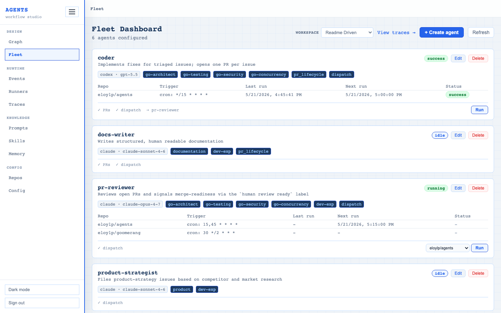
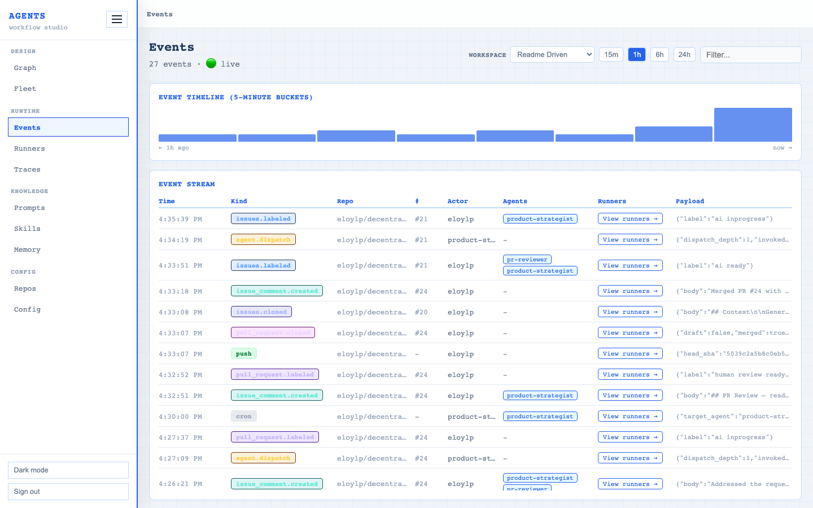
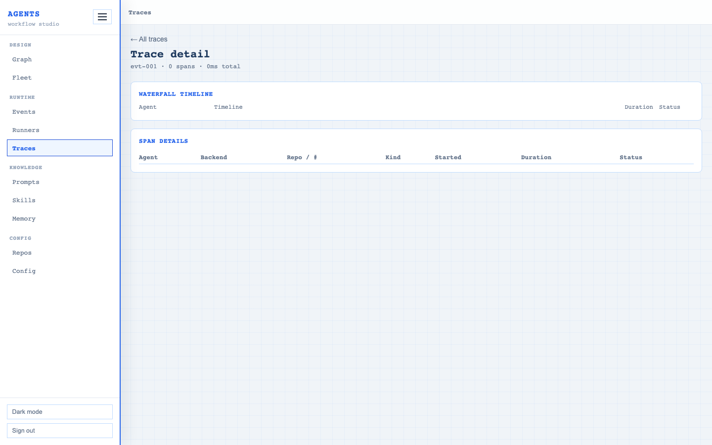
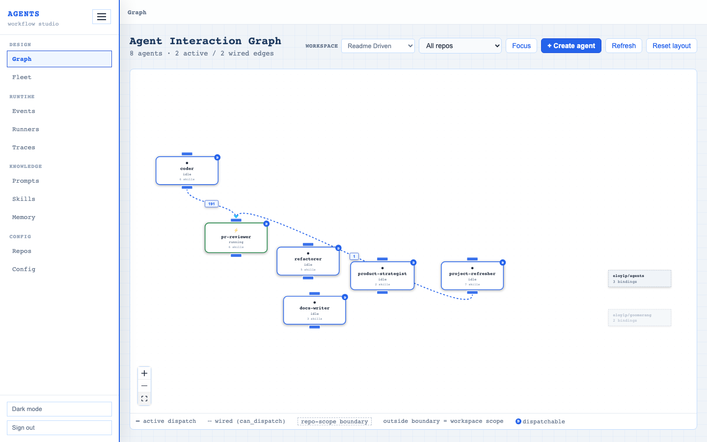
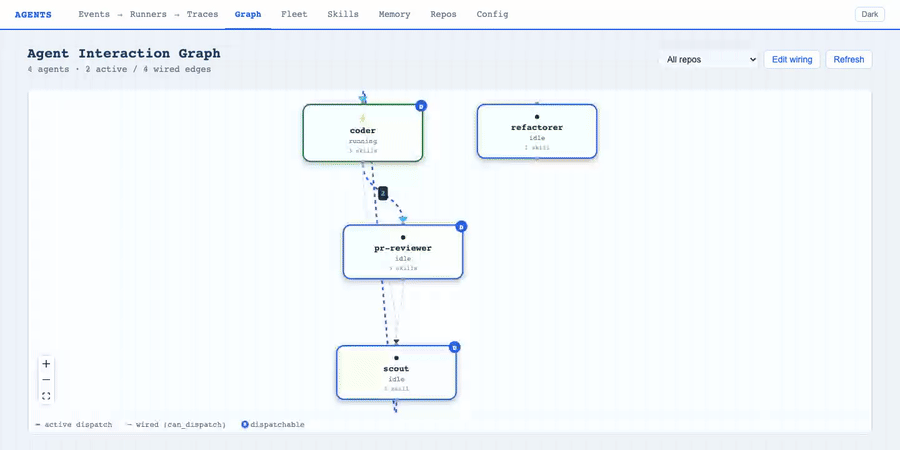
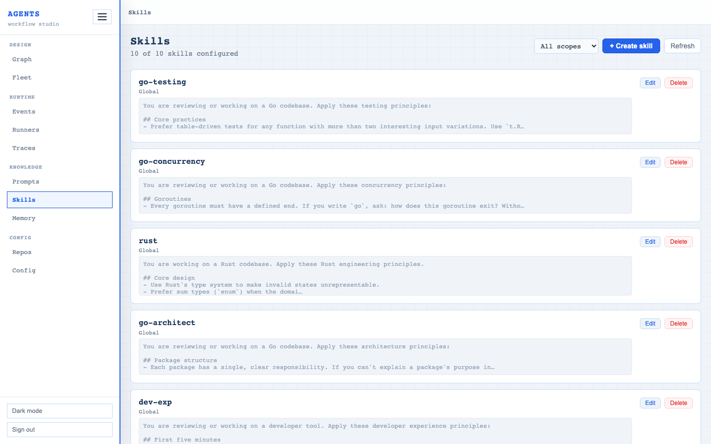
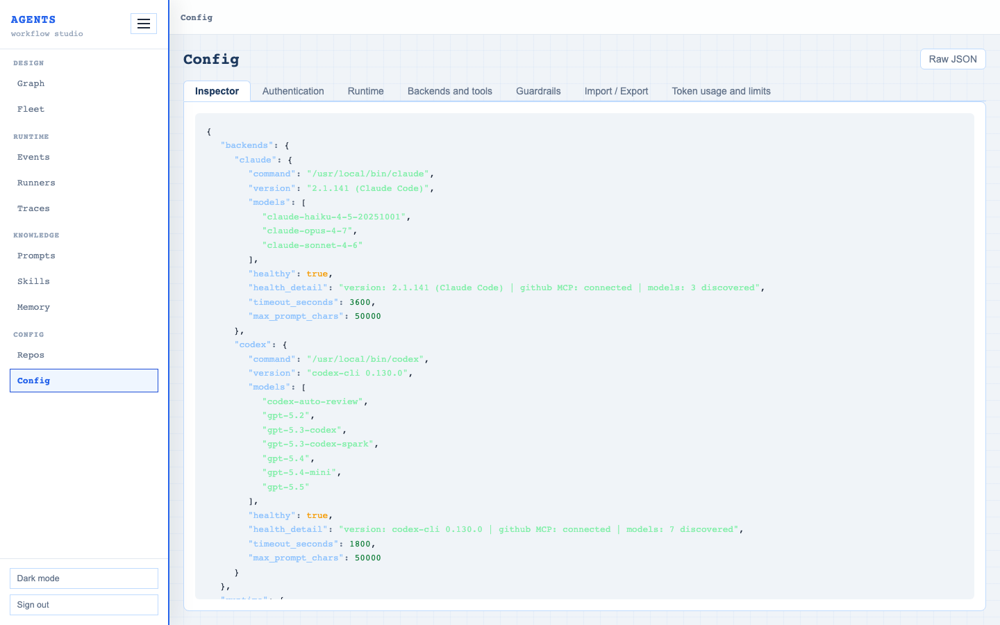
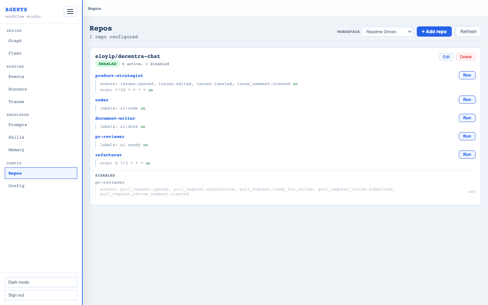
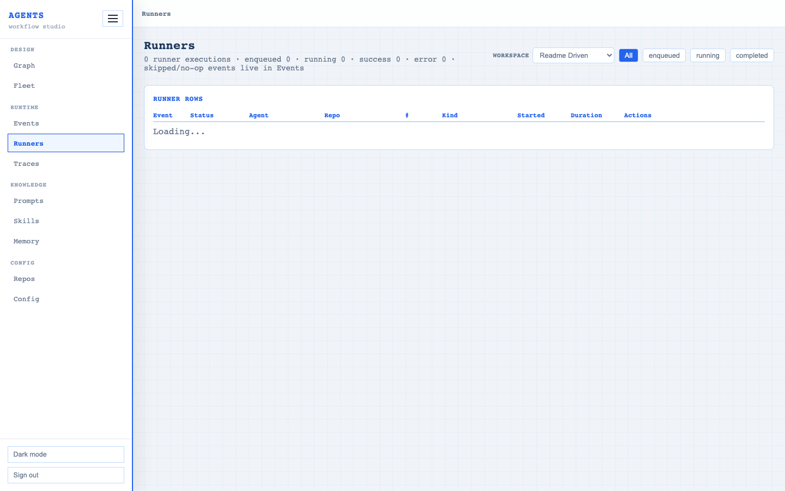
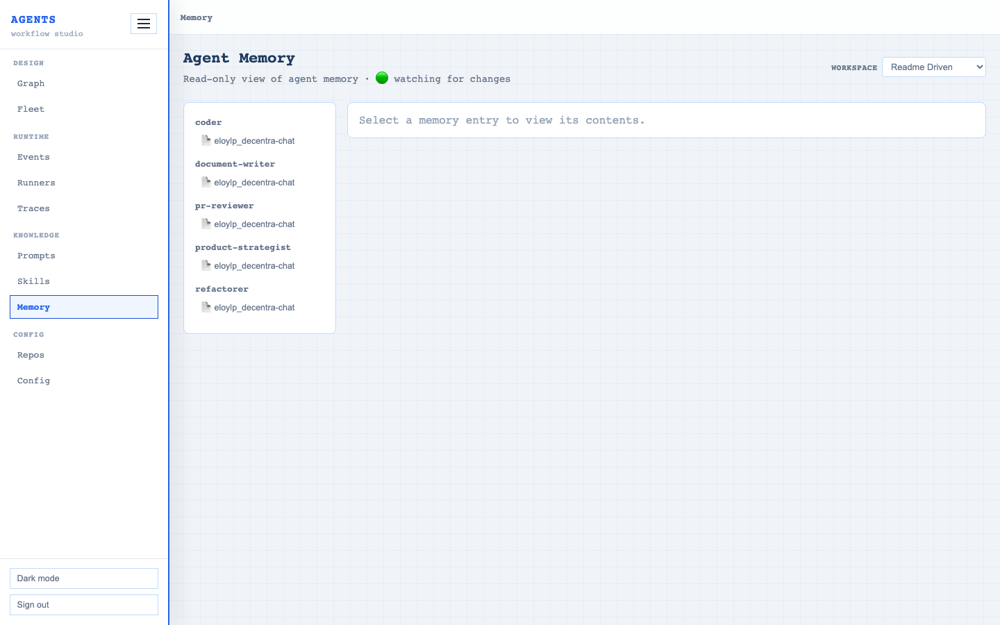

# Web dashboard

The daemon ships an embedded web dashboard at `/ui/`. It is the primary interface for managing the fleet. Every CRUD operation (agents, skills, backends, repos, bindings) is available there alongside live monitoring.



## Pages

### Events

Live event firehose with SSE streaming. Every kind of event flows through here: webhooks (`issues.*`, `pull_request.*`, `push`, ...), cron ticks (`cron`), on-demand triggers (`agents.run`), and inter-agent dispatches (`agent.dispatch`). Each row carries time, kind, repo, number, actor, an **agents** column with badges for every agent that ran (or is running) for that event, each badge links to the Fleet page, and a **View runners** link that opens the Runners page filtered to the event id with the matching rows pulsing on arrival.



### Traces

Agent run traces with timing, status, and a drill-down to the tool-loop transcript. Each span exposes:

- **Token usage**, input / output / cache hit / cache write counts straight from the AI CLI's reported usage. Cache hit ratio shown inline; useful for spotting agents that bust the prompt cache and tuning their composition.
- **Prompt**, the exact composed prompt the daemon sent to the AI CLI on this run. Gzipped on disk, lazy-fetched via `/traces/{span_id}/prompt` when expanded. This is the operator's "what did the agent see" debug surface.
- **Tool-loop transcript**, ordered tool calls with input / output summaries and durations.
- Summary, error message (when the run failed), Gantt position in the dispatch chain.



### Graph

Visual dispatch graph showing which agents invoke which, with edge counts. Toggle "Edit wiring" to add or remove dispatch connections by drag-and-drop. The change writes back to the source agent's `can_dispatch` list and the target's `allow_dispatch` flag.





### Agents

Fleet snapshot with per-agent status, skills, bindings, dispatch wiring. Create, edit, and delete agents from this page. Long-form fields like the agent prompt show an **⛶ Expand** affordance that pops the editor into a fullscreen modal, same `value` flows back into the form on close.

<!-- The Fleet page (above) is the agents page: same surface, same capture. -->


### Skills

Manage the reusable guidance blocks composed into agent prompts. Create, edit, delete. The skill body editor has the same **⛶ Expand** affordance as the agent prompt, useful when a skill grows past a screenful.



### Backends and tools

Backend discovery status, including per-backend GitHub MCP connectivity. Manage runtime limits (timeout, max prompt chars), local-backend URLs, and orphaned-model remediation. Lives as a tab inside the Config page.



### Guardrails

Tab inside the Config page. Lists every prompt guardrail prepended to every agent's composed prompt at render time, with built-in / disabled / position badges. Click a row to edit name, description, content (markdown editor with **⛶ Expand** affordance), enabled toggle, and position. **Reset to default** restores a built-in's seeded text. **Delete** asks for double confirmation, with a stronger warning when the row is built-in. Disabling the shipped 'security' guardrail surfaces an extra-stern confirm modal explaining what protection is removed. The shipped daemon arrives with one built-in guardrail (`security`) seeded by migration 010; operators can add code-style, deployment-policy, or any other policy block on top.

### Repos

Repository bindings. Wire agents to repos with labels, events, or cron triggers. Each binding has its own enable / disable toggle.



### Runners

Operator view of the work that's running and recently ran. Each row is one runner, a unit of work the daemon picked up. Mental model:

1. **Event arrives** → visible on the Events page (firehose).
2. **Runners working** → visible here (this page). One row per (event, agent) once traces have been recorded; one row per event with no agent badge while in-flight.
3. **Execution detail** → visible on the Traces page (tool-loop transcript).

The page combines two sources: the durable `event_queue` table for in-flight lifecycle (so freshly queued and currently fanning-out events stay visible), plus per-agent trace spans for completed runs. Once the event_queue row is pruned (>7 days), the trace alone is the source of truth.

Each row carries: event id, queue lifecycle status (`enqueued` / `running`) or trace status (`success` / `error`), agent badge (links to the Fleet page), repo, kind, started at, duration. Click any row to expand: actor, payload, and a **View trace detail** link to `/ui/traces/<event_id>`.

Two per-row actions, both **event-level** (a single event_queue row drives multiple displayed rows after fan-out, so the actions affect every fanned-out agent for that event, the confirm dialog says so explicitly):

- **Retry** copies the original event blob into a fresh `event_queue` row with a new `enqueued_at` and pushes it onto the channel, the source row stays as audit history. Disabled while the source is in `enqueued` or `running` state.
- **Delete** removes the event_queue row from the table. Best-effort: a worker that has already dequeued the `QueuedEvent` from the channel buffer will still run it; the row simply won't appear in subsequent listings.

Arriving with `?event=<id>` (e.g. via the **View runners** link on the Events page) filters to the runners for that event and pulses the matching rows for ~3s so the operator can spot them at a glance.

**Live stream.** Rows in the `running` state with a known `span_id` show a `▶ Live` button. Clicking it opens a modal that subscribes to `/traces/{span_id}/stream` and renders the AI CLI's stdout as an annotated stream, `🔧 tool call` cards, `💬 thinking` text, `📤 tool result` payloads. Each card collapses to a one-line preview by default and expands to the raw JSON. The modal handles both Anthropic's stream-json shape (claude) and OpenAI's chat-completion-chunk shape (codex); unknown shapes fall back to a `raw output` card that preserves the full JSON. Arriving mid-run replays the per-span ring buffer (last ~1000 lines) before live-tailing. When the run ends, the modal shows a "✓ Run completed" footer with a link to the trace detail. The stream is in-memory only, restarting the daemon loses the live tail; structured trace data stays in SQLite. The view auto-follows new entries as they arrive; if you scroll up to read older output, a **↓ Latest** pill appears that re-sticks scroll to the bottom on click.



### Memory

Raw agent memory markdown per `(agent, repo)` pair. Useful for inspecting what an autonomous agent has learned across runs.



### Config

Effective parsed config (secrets redacted). Includes YAML import/export.

![Config inspector, webhook_secret rendered as `[redacted]`](img/config.png)

## Authentication

The dashboard is unauthenticated at the daemon level. Place the daemon behind a reverse proxy that gates `/ui/`, `/runners`, and the rest of the authenticated surface (everything except `/webhooks/github`, `/status`, `/run`, `/v1/*`). See [security.md → Reverse-proxy routing](security.md#reverse-proxy-routing) for one concrete pattern using Traefik basic-auth.

## Regenerating these screenshots

The images in `docs/img/` are generated from a synthetic fixture so the
content stays neutral and reproducible. Regenerate after a UI change:

```bash
# Terminal 1, boot the seeded daemon on :8081
go run ./cmd/screenshotseed

# Terminal 2, drive headless Chromium (Playwright) + ffmpeg → docs/img/
cd internal/ui
node scripts/screenshots.mjs
```

`cmd/screenshotseed` builds a tempdir SQLite, imports a fictional fleet
(`acme/widgets`, `acme/control-plane`), seeds events / traces / dispatch
history, registers an in-flight `pr-reviewer` run on event #144, and
swaps the AI runner for a stub that blocks forever, so the runners
page shows live rows for the screenshot rather than completed-but-failed
ones (the screenshotting host has no real `claude` / `codex` binary).
First-time setup needs `npm install --save-dev playwright` in
`internal/ui` and `npx playwright install chromium`. The graph edit
GIF additionally needs `ffmpeg`.
